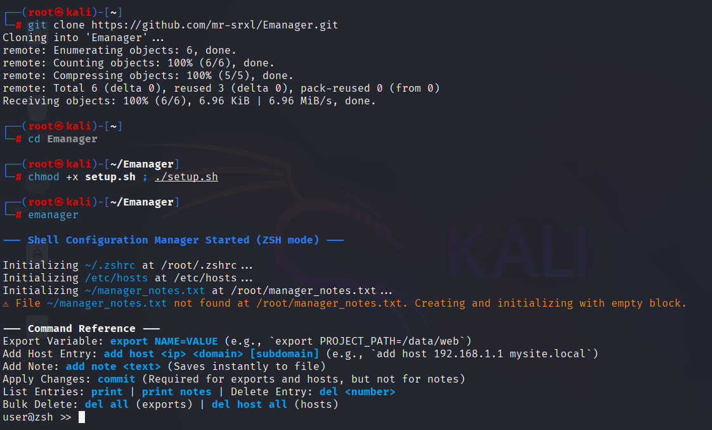
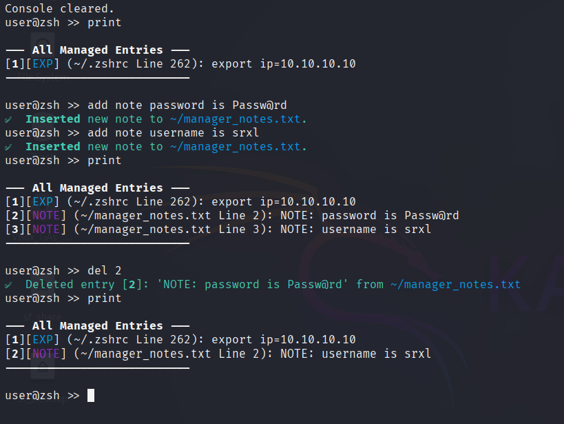

# Emanger: Stop Juggling Configs, Start Hacking

A simple, terminal-based session manager for hackers, security researchers, and CTF players.

---

## The Problem

If you're a pentester or CTF player, you know the drill: constantly switching between tabs, firing up a separate notes app, and running `sudo nano` just to add a target's IP to your `/etc/hosts`. This context-switching wastes time and breaks your focus.

**Emanger** was built to eliminate that friction. Originally an old personal project, it has been recently completed to provide a lightweight tool that lives in your terminal and gives you a single, clean interface to manage three common session tasks: **environment variables, the `/etc/hosts` file, and quick notes.**

---

## ✨ Key Features

Emanger streamlines your workflow by making temporary configurations fast, clean, and safe.

|**Feature**|**Solves the Pain Point**|**Quick Command Example**|
|---|---|---|
|**Atomic Updates**|Accidentally applying half-finished or incorrect configs.|`commit` (Applies all staged changes at once)|
|**Painless Hosts**|Slow `sudo` editing of `/etc/hosts` and risking duplicates.|`add host 10.10.10.15 target.local`|
|**Quick Exports**|Manually re-typing or hunting for common session variables.|`export LHOST=10.10.1.1`|
|**Terminal Notes**|Opening a separate app for quick payloads or reminders.|`add note "SQLi: 1' OR 1=1--"`|
|**Granular Cleanup**|Leaving stray configs in your VM that cause conflicts.|`del all` (Wipes exports) or `del host all` (Wipes hosts)|

---

## 🚀 Getting Started

### ❗ Prerequisites: Root User Only ❗

**This script is designed exclusively for the `root` user.** Because Emanger directly modifies system files like `/etc/hosts`, it requires elevated privileges to function correctly. Running it without `sudo` or as a non-root user will cause errors.

### Installation

**Clone the repository:**

```
git clone https://github.com/mr-srxl/Emanager.git
```

 **Navigate into the directory:**
```
cd Emanager
```

  make the emanager command available system-wide.
  
``` bash
 chmod +x setup.sh ; ./setup.sh
```

 Launch the tool!
```bash
emanager
```


---

## 💻 Usage

Emanger uses a staging system for safety. Changes to **hosts** and **exports** are queued up and only applied to your system when you run the `commit` command. Notes, however, are saved instantly.

### Core Workflow

1. **Stage Changes:** Use the `add host` and `export` commands to queue up your changes.
    
2. **Review:** Use the `print` command to see all your staged changes and saved notes.
    
3. **Apply:** Use `commit` to write the staged changes to your system files (`/etc/hosts` and environment).
    

### Command Reference

- **View Everything:** Shows a numbered list of all staged changes (hosts, exports) and saved notes.
```
 print
```

- **Apply Staged Changes:** Writes all pending host and export changes to the system.

```
   commit
```


### Managing Hosts

- **Add a host entry:**
    
    ```
    add host <IP_ADDRESS> <HOSTNAME>
    # Example: add host 10.10.10.15 target.local
    ```
    

### Managing Environment Variables

- **Add or update an export:**

 ```
  export <KEY>=<VALUE>
  # Example: export LHOST=10.10.14.2
  ```

![[help_1.png]]
### Managing Notes (Instantly Saved)

- **Add a note:**
```
 add note "Your note with spaces here"
 ```
   
- **To view your notes, use the main `print` command.**

### Deleting Entries

The `print` command displays a numbered list of all entries. Use the corresponding number to delete a specific item from the list.

- **Delete a specific entry (host, export, or note):**
 ```
  del <NUMBER>
  # Example: del 3
 ```




- **Bulk delete all staged exports:**

 ```
 del all
```

- **Bulk delete all managed hosts:**
```
 del host all
 ```

---

